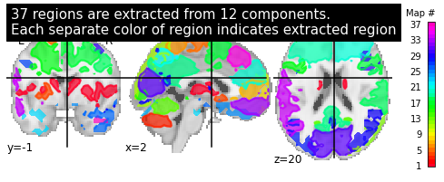
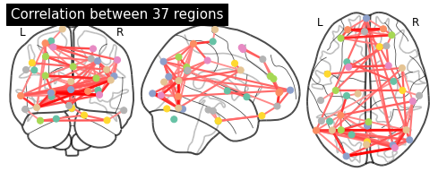
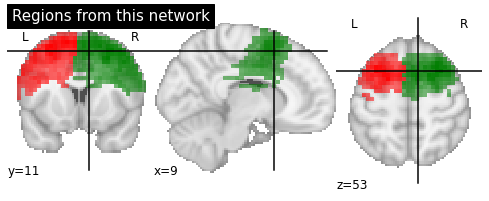
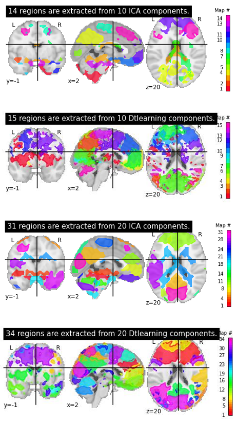
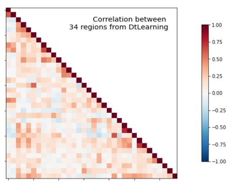
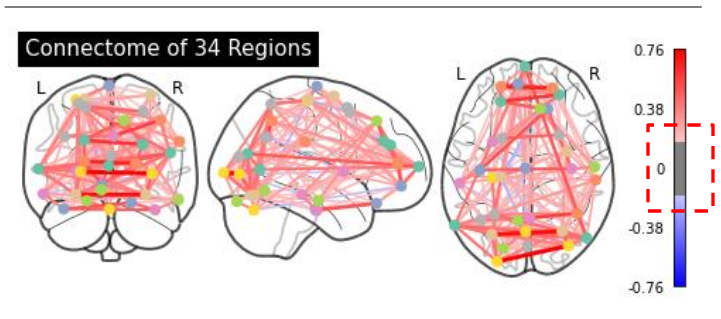
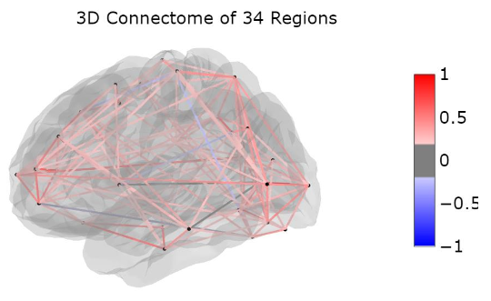

# machine-learning-applications-on-fmri

功能性 MRI 資料的機器學習應用研究。  
Machine learning applications for functional MRI analysis and research.

---

## 概述 | Overview

本專案展示使用 Nilearn 函式庫對功能性 MRI（fMRI）資料應用機器學習技術的實際案例，包含 CanICA、dictionary learning 與功能性連結分析等實作練習，內容改編自 Nilearn 官方文件。研究核心已遷移至 `run.py + src/` 的模組化結構，notebook 已從版本管理中移除。  
This project showcases practical applications of machine learning techniques on functional MRI (fMRI) data using the Nilearn library. It includes hands-on exercises and example workflows such as CanICA, dictionary learning, and functional connectivity analysis, adapted from the official Nilearn documentation.

**注意事項 | Note**：本專案僅供教育與個人學習用途。This project is intended solely for educational and personal study purposes.

---

## 類別與狀態 | Category and Lifecycle

- **類別 | Category**：Research
- **類型 | Type**：Machine Learning | fMRI
- **生命週期 | Lifecycle**：stable
- **標籤 | Tags**：machine-learning, fmri, research

---

## 結構 | Structure

```text
Research/machine-learning-applications-in-fmri/
├── assets/                 # 示意圖與結果圖片 | Diagrams and result images
├── configs/                # 路徑與分析參數 | Paths and analysis defaults
├── outputs/                # 可重建輸出 | Reproducible outputs
├── run.py                  # 正式入口 | Script entrypoint
├── requirements.txt        # Python dependencies
├── scripts/                # 正式工作流程腳本 | Reproducible workflow scripts
├── src/
│   ├── data/               # 資料載入與資料容器 | Dataset loading and bundles
│   ├── model/              # CanICA / DictLearning 模型封裝
│   ├── regions/            # Region extraction
│   ├── connectivity/       # Timeseries 與 connectome 計算
│   ├── plot/               # Components / regions / connectivity plots
│   ├── pipeline/           # 跨模組流程組裝 | Pipeline orchestration
│   └── io/                 # NIfTI 輸出等 I/O helpers
└── README.md               # 本文件 | This file
```

---

## 如何執行 | How to Run

1. 安裝相依套件 | Install dependencies:
   ```bash
   pip install -r requirements.txt
   ```

2. 執行模組化分析流程。  
   Run the script-based analysis pipeline.
   ```bash
   python run.py --model both
   python run.py --model dict --connectivity
   python scripts/group_ica_dictlearn_workflow.py
   ```

3. 靜態示意圖仍保留在 `assets/`，可重建的分析輸出則寫入 `outputs/`。  
   Static reference figures remain in `assets/`, while reproducible analysis outputs are written to `outputs/`.

---

## 相依項目 | Dependencies

- Nilearn
- Scikit-learn
- NumPy
- Matplotlib

---

## 輸出與展示 | Outputs and Demos

### 研究工作流程圖 | Research Workflow Diagram


### ROI 研究結果 | Research Result of ROI




### 比較研究結果 | Research Result of Comparison


### 腦區研究結果 | Research Result of Region


### 視覺化研究結果 | Research Result of Visualization



---

## 注意事項 | Notes and Limitations

- 僅供教育與個人學習用途，不適用於商業使用或散布。For educational and personal study purposes only; not for commercial use or distribution.
- 內容改編自 Nilearn 官方文件範例。Adapted from Nilearn documentation examples.
- Notebook 已移除，分析流程以 `run.py` 與 `scripts/` 下的 Python workflow 為唯一入口。The notebooks have been removed; `run.py` and the Python workflows under `scripts/` are now the only supported entrypoints.

---

## 相關連結 | Related Links

- [Nilearn 官方文件 | Nilearn Official Documentation](https://nilearn.github.io/)
- [Nilearn GitHub Repository](https://github.com/nilearn/nilearn/)
- [專案 Catalog | Project Catalog](../../catalog/index.md)
- [Repository 根目錄 | Repository Root](../../README.md)

---

## 致謝 | Acknowledgments

Nilearn 提供了便於使用且多功能的腦容積分析工具，包含統計與機器學習工具，並擁有詳盡的文件與友善的社群。  
Nilearn enables approachable and versatile analyses of brain volumes. It provides statistical and machine-learning tools, with instructive documentation & friendly community.

### 參考文獻 | Reference

Abraham Alexandre, Pedregosa Fabian, Eickenberg Michael, Gervais Philippe, Mueller Andreas, Kossaifi Jean, Gramfort Alexandre, Thirion Bertrand, Varoquaux Gael (2014). "Machine Learning for Neuroimaging with scikit-learn". *Frontiers in Neuroinformatics*, Volume 8, Pages 14. DOI: [10.3389/fninf.2014.00014](https://doi.org/10.3389/fninf.2014.00014)
